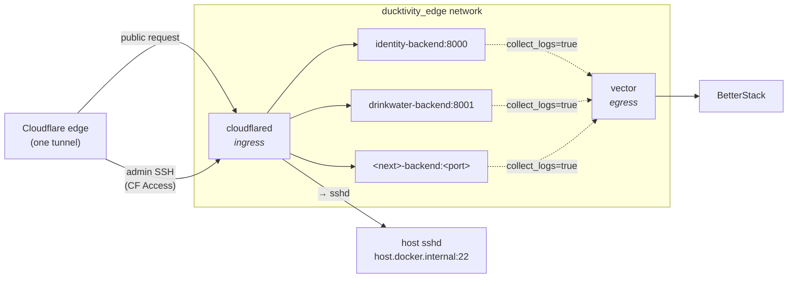

# Ducktivity Edge Stack

The edge stack is the **boundary layer** of the Ducktivity box: the shared services
that sit between the outside world and the app containers. Nothing app-specific lives
here — every app plugs into it.

It runs two containers and owns one network:

| Piece                       | Role                                                                                          |
| --------------------------- | --------------------------------------------------------------------------------------------- |
| `cloudflared`               | **Ingress.** The one Cloudflare tunnel connector for the whole suite. Also brokers admin SSH. |
| `vector`                    | **Egress.** The one log shipper for the box. Ships every app's logs to BetterStack.           |
| `ducktivity_edge` (network) | Where the apps meet these two services.                                                       |

## How it works



**Ingress (traffic in).** `cloudflared` dials _out_ to Cloudflare and holds the tunnel
open — the box opens no inbound ports. A public request for e.g. `id.ducktvt.com` hits
Cloudflare's edge, travels down the tunnel, and `cloudflared` forwards it over the
`ducktivity_edge` network to that app's container (`identity-backend:8000`). The
hostname → container mapping is configured in the Cloudflare dashboard (the tunnel's
**Public Hostnames**), not here.

**Admin SSH.** The same `cloudflared` also brokers Cloudflare Access SSH to the box's
host sshd (`ssh://host.docker.internal:22`). That's how CI deploys reach the box.

**Egress (logs out).** `vector` reads the Docker socket and tails every container
labeled `collect_logs=true` — across all Compose projects, not just this one — then
ships the logs to BetterStack. One shipper for the whole box, so logs are never
duplicated.

## How an app plugs in

An app never runs its own `cloudflared` or `vector`. It just:

1. Attaches its `app` service to the external `ducktivity_edge` network with a **unique
   alias** (`identity-backend`, `drinkwater-backend`, …).
2. Carries the `collect_logs: "true"` label so `vector` ships its logs.
3. Gets a **Public Hostname** rule added in the Cloudflare tunnel:
   `<app-api>.ducktvt.com → http://<app>-backend:<port>`.

No new tunnel, no new connector token, no new log shipper — ever.

## Files

| File                 | What                                                                     |
| -------------------- | ------------------------------------------------------------------------ |
| `docker-compose.yml` | The `cloudflared` + `vector` services and the `ducktivity_edge` network. |
| `vector/vector.yaml` | Vector's pipeline (tail by label → BetterStack).                         |
| `.env`               | The stack's secrets (see `.env.example`). Not committed.                 |

## Running it

The stack lives at `/opt/ducktivity/edge` on the box.

```bash
cd /opt/ducktivity/edge
docker compose up -d      # start / apply changes
docker compose ps         # cloudflared + vector should be running
docker compose logs -f    # follow
```

It must be up **before** any app, because it creates the `ducktivity_edge` network the
apps attach to.
